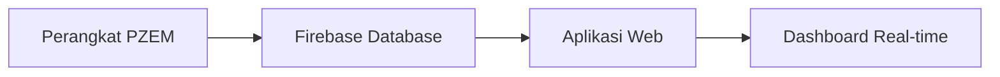

Selamat datang di **Electric Monitoring System** - platform dasbor komprehensif yang dirancang untuk memantau sistem kelistrikan secara real-time. Sistem ini dikembangkan sebagai proyek PKA oleh **Riswandi, S.T., M.Sos** dan dapat diakses melalui [iot-siaga.rri.go.id](http://iot-siaga.rri.go.id).

## Gambaran Umum

Electric Monitoring System adalah solusi canggih untuk pemantauan dan analisis mendalam kualitas daya, efisiensi, dan performa sistem kelistrikan untuk aplikasi industri. Platform ini menggabungkan teknologi IoT dengan visualisasi data yang intuitif untuk memberikan wawasan real-time tentang kondisi sistem kelistrikan.

## Arsitektur Sistem

Sistem ini memiliki arsitektur data yang solid dengan alur:
**Perangkat PZEM** → **Firebase (Database Real-time)** → **Aplikasi Web**

## Fitur Utama

### 🔍 **Pemantauan Real-time**
- Monitoring tegangan, arus, dan daya secara langsung
- Update data setiap 5 detik dari sensor PZEM
- Visualisasi interaktif dengan grafik yang responsif

### 📊 **7 Tab Analisis Komprehensif**
1. **Overview** - Ringkasan KPI dan tren utama
2. **Tegangan** - Analisis kualitas dan ketidakseimbangan tegangan
3. **Arus** - Monitoring beban dan distorsi arus
4. **Daya** - Analisis efisiensi dan power triangle
5. **Power Factor** - Pemantauan faktor daya mendalam
6. **Device** - Status perangkat PZEM individual
7. **Data Management** - Filter dan optimasi data historis

### ⚡ **Indikator Kinerja Utama (KPI)**
- **Tegangan Rata-rata**: Status normal 210-230V
- **Arus Rata-rata**: Tracking tren perubahan
- **Total Daya Aktif**: Indikator efisiensi utama
- **Power Factor**: Rating Excellent (&gt;0.95), Good (&gt;0.90), Poor (&lt;0.90)

### 🎯 **Analisis Kualitas Daya**
- **THD (Total Harmonic Distortion)**: Deteksi polusi gelombang
- **Ketidakseimbangan Fase**: Monitoring kesehatan peralatan
- **Regulasi Tegangan**: Stabilitas sistem
- **Flicker Detection**: Deteksi fluktuasi tegangan

## Teknologi yang Digunakan

- **Frontend**: Next.js, React, TypeScript
- **Database**: Firebase Realtime Database
- **Hardware**: Sensor PZEM untuk monitoring 3-phase
- **Visualisasi**: Recharts untuk grafik interaktif
- **Storage**: IndexedDB untuk data historis

## Optimasi Performa

### 🚀 **Manajemen Data Cerdas**
- **Kompresi Data**: Reduksi ukuran 60-80%
- **Caching Strategy**: Hit rate &gt;90%
- **Memory Management**: &lt;50MB penggunaan memori
- **Load Time**: &lt;1s (24h), &lt;5s (7d), &lt;10s (1m)

### 📈 **Storage Strategy**
- **24 jam**: localStorage (akses cepat)
- **7 hari**: IndexedDB (dataset medium)
- **1 bulan**: Hybrid system (dataset besar)

## Keunggulan Sistem

✅ **Real-time Monitoring** dengan update 5 detik  
✅ **Analisis Mendalam** 7 aspek kelistrikan  
✅ **Optimasi Performa** untuk dataset besar  
✅ **Interface Intuitif** dengan visualisasi modern  
✅ **Formula Standar** kelistrikan industri  
✅ **Responsive Design** untuk semua perangkat  

## Target Pengguna

- **Engineer Listrik** - Monitoring dan analisis sistem
- **Facility Manager** - Optimasi efisiensi energi
- **Maintenance Team** - Deteksi dini masalah
- **Management** - Laporan performa dan KPI

---

Sistem ini dirancang tidak hanya untuk pemantauan, tetapi juga untuk analisis mendalam yang membantu dalam pengambilan keputusan operasional dan pemeliharaan sistem kelistrikan.
